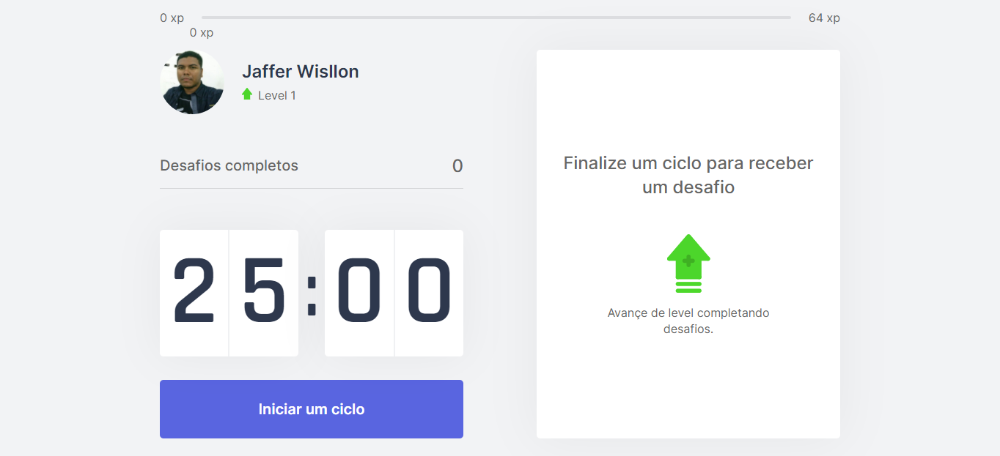

<h1 align="center">
  
</h1>

 


## Sobre
Projeto consiste em um pomodoro que lança desafios para fazer exercicios como forma terapêutica após passar determinado tempo em frente ao computador.

## Preview


## Tecnologias
- React
- Next.js
- Typescript

## Excutando o projeto
- Clone o repositório: 
- Instale todas as dependências com: ``` yarn ``` ou ``` npm install ```
- Inicio projeto: ``` yarn dev ``` ou ``` npm run dev ```

Acesse o projeto no endereço
http://localhost:3000
